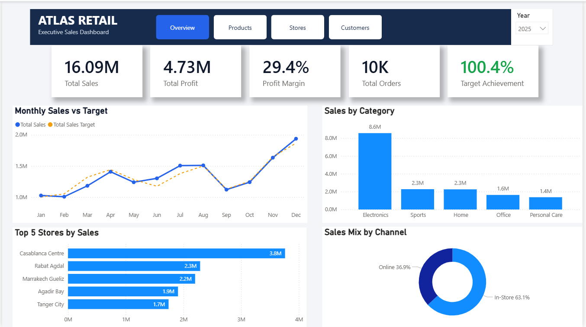
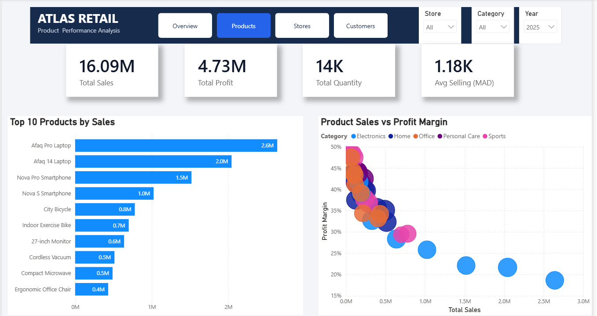
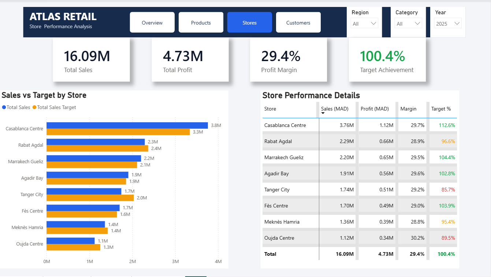
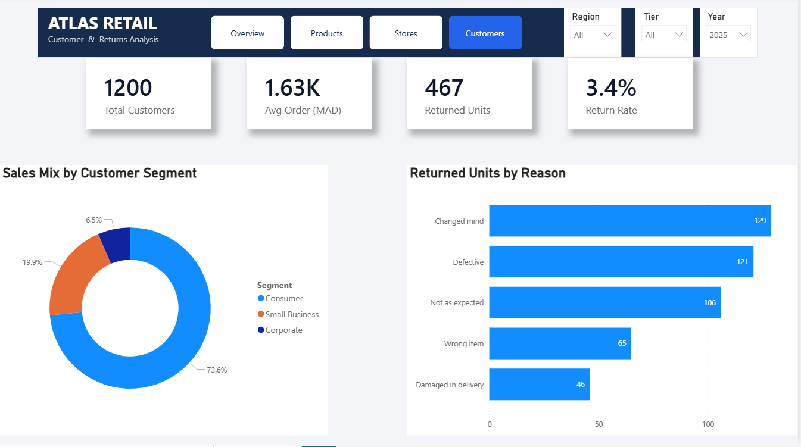
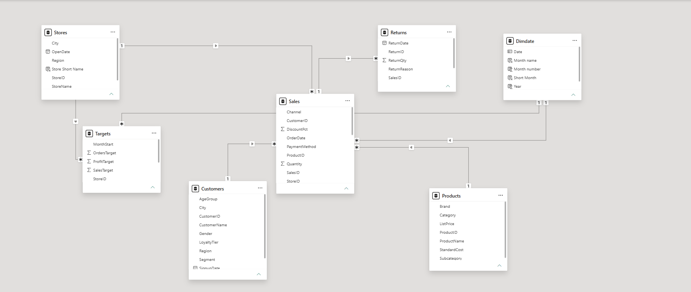

# Atlas Retail Analytics Dashboard


An interactive Power BI dashboard created to analyze the sales, profitability, targets, products, stores, customers, and returns of a fictional Moroccan retail company.

The project transforms retail data into clear business insights that can help decision-makers monitor performance, identify underperforming areas, and discover growth opportunities.

> **Dataset notice:** The data used in this project is synthetic and intended for learning and portfolio demonstration purposes.



## Project Objectives

The dashboard was designed to answer the following business questions:

- Are total sales and profit meeting company targets?
- How does performance change from month to month?
- Which products and categories generate the most revenue?
- Which high-selling products have weaker profit margins?
- Which stores are above or below their targets?
- How are sales distributed between in-store and online channels?
- Which customer segments contribute the most sales?
- What are the main reasons for product returns?

## Key Performance Indicators

| KPI | Result |
|---|---:|
| Total Sales | MAD 16.09M |
| Total Profit | MAD 4.73M |
| Profit Margin | 29.4% |
| Total Orders | 10K |
| Target Achievement | 100.4% |
| Total Customers | 1,200 |
| Returned Units | 467 |
| Return Rate | 3.4% |

## Dashboard Pages

### 1. Executive Overview

Provides a high-level view of sales, profit, profit margin, orders, target achievement, monthly performance, categories, stores, and sales channels.


### 2. Product Performance Analysis

Highlights the top-selling products and compares product sales with profit margin to identify high-revenue products that may require pricing or cost optimization.



### 3. Store Performance Analysis

Compares actual sales with store targets and uses conditional formatting to identify stores that are above, close to, or below target.



### 4. Customer and Returns Analysis

Analyzes customer segments, average order value, returned units, return rate, and the most common reasons for returns.



## Data Model

The semantic model follows a star-schema / fact-constellation approach.

- **Fact tables:** Sales, Targets, and Returns
- **Dimension tables:** DimDate, Products, Customers, and Stores
- **Relationships:** One-to-many relationships with controlled filter direction

This structure improves filtering behavior and keeps the DAX measures reusable across the report pages.



## Data Preparation

Power Query was used to:

- Import and transform the source tables
- Promote headers and assign appropriate data types
- Standardize date, identifier, numeric, and percentage fields
- Review missing values and data-quality issues
- Prepare clean fact and dimension tables for analysis

## Key DAX Measures

The report includes reusable business measures such as:

- Total Sales
- Total Profit
- Profit Margin
- Total Orders
- Total Customers
- Total Quantity
- Total Sales Target
- Target Achievement
- Average Order Value
- Average Selling Price
- Total Returned Quantity
- Return Rate
- Target Status
- Conditional-formatting color measures

Example:

```DAX
Target Achievement =
DIVIDE(
    [Total Sales],
    [Total Sales Target],
    0
)```

## Key Insights

- Total sales reached **MAD 16.09M**, generating **MAD 4.73M** in profit.
- The overall profit margin was **29.4%**.
- Sales achieved **100.4% of the annual target**.
- Electronics generated approximately **MAD 8.6M**, making it the leading category.
- December recorded the strongest monthly sales performance.
- In-store sales represented **63.1%**, compared with **36.9%** for online sales.
- Casablanca Centre was the leading store with approximately **MAD 3.76M** in sales and **112.6% target achievement**.
- Tanger City and Oujda Centre showed significant target gaps.
- The Consumer segment represented approximately **73.6%** of the sales mix.
- The return rate was **3.4%**.
- “Changed mind,” “Defective,” and “Not as expected” were the leading return reasons.

## Business Recommendations

- Strengthen other product categories to reduce dependency on Electronics.
- Prepare inventory and marketing capacity for the strong year-end period.
- Investigate pricing, demand, and product mix in underperforming stores.
- Review discounts and costs for high-sales, low-margin products.
- Improve product information and quality control to reduce returns.
- Develop targeted offers for Small Business and Corporate customers.
- Strengthen the online channel while maintaining in-store performance.

## Interactive Features

- Navigation across four analytical pages
- Year, category, store, region, and customer-tier filters
- Cross-filtering between visuals
- Conditional formatting for store target performance
- Product-level report tooltip
- Top-N product and store analysis
- Dynamic KPI cards

## Tools and Skills Demonstrated

- Microsoft Power BI Desktop
- Power Query
- DAX
- Data cleaning and transformation
- Data modeling
- Business KPI design
- Data visualization and dashboard UI/UX
- Business insight generation

## Repository Contents

```text
atlas-retail-power-bi-dashboard/
│
├── README.md
├── Atlas_Retail_Analytics_Mohamed_Ouazzan.pbix
├── 01_Atlas_Retail_Overview.png
├── 02_Atlas_Retail_Products.png
├── 03_Atlas_Retail_Stores.png
├── 04_Atlas_Retail_Customers_Returns.png
└── 05_Atlas_Retail_Data_Model.png
```

## How to Explore the Project

1. Download the Power BI file using the link below.
2. Open it with Microsoft Power BI Desktop.
3. Use the navigation buttons to move between the four pages.
4. Apply the available filters to explore the data.
5. Hover over product visuals to view additional details.

[Download the Power BI Dashboard](Atlas_Retail_Analytics_Mohamed_Ouazzan.pbix)

## Author

**Mohamed Ouazzan**

Aspiring Data Analyst | Power BI | Data Visualization | DAX

[Connect with me on LinkedIn](https://www.linkedin.com/in/mohamed-ouazzan/)
